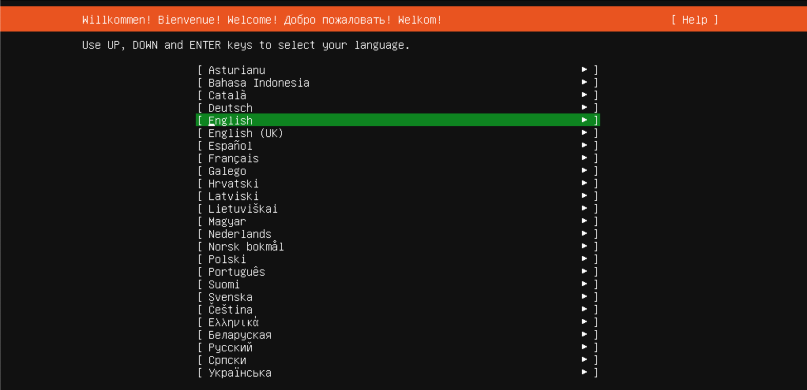
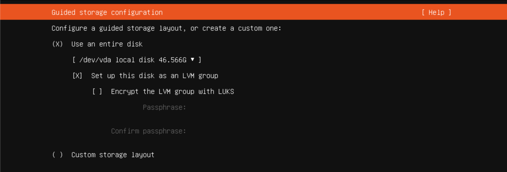
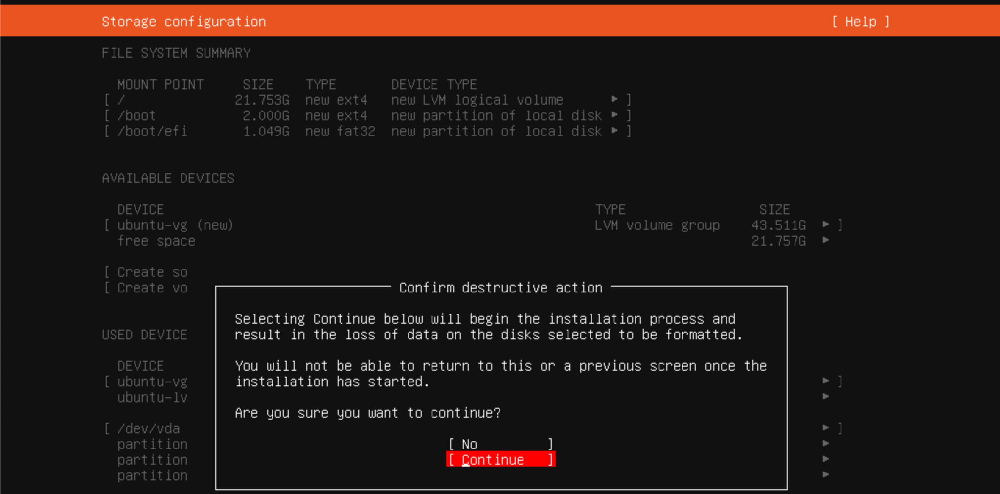

# Installing Ubuntu

Now that we've gotten the Virtual Machine set up with an Ubuntu installation disk, it's time to finally install Ubuntu on it.

The first thing you'll be met with is `GNU GRUB`, which is what is known as a `boot loader`. For now all we have to do is hit `return` / `enter` on the first option to install Ubuntu.

Now that we've started the installer, you should see the language selection screen:

Hit the `enter`/`return` key to accept the current selection, which should be `English`. Hit `done` on the next screen.

Make sure `Ubuntu Server` is selected in the next screen, and hit `done`. Keep selecting `done` until you come across the storage configuration:

The default settings are fine in this screen, but the selection has moved to the top. Use the down arrow key to highlight `done` and then accept it.

Keep accepting the next prompts until you come across to the final screen asking to `Confirm destructive action`:

Highlight and accept `Continue`, which will then prompt you for user information. Fill these out to your liking and hit `Done`.

In the next two screens, don't change anything and simply hit `Continue`. Installation will now begin!

Wait for installation to complete and close the Virtual Machine. You are now done with the installation and are ready to use Ubuntu!